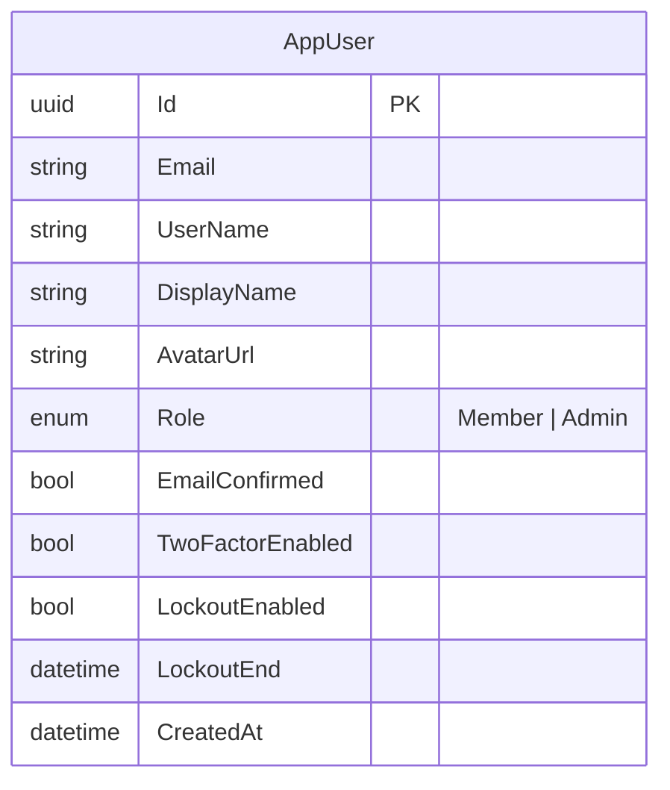

# Domain Model — Identity

## ERD

`AppUser` extends ASP.NET `IdentityUser<Guid>`. No other aggregate exists in this service — all other entities (roles, tokens, claims) are managed by the Identity framework tables.

## Aggregates & Invariants

### AppUser
| Invariant | Where enforced |
|---|---|
| Email must be a valid address | `Email.From(string)` value object |
| Must confirm email before login | `IdentityManager.LoginAsync` |
| Account lockout prevents login | `IdentityManager.LoginAsync` via `IPasswordAuthenticationEngine` |
| Avatar: max 5 MB | `IdentityManager.UploadAvatarAsync` |
| Avatar: PNG, JPEG, WebP, GIF only | `IdentityManager.UploadAvatarAsync` |
| 2FA token must be verified to log in when 2FA enabled | `IdentityManager.LoginAsync` + `VerifyTwoFactorAsync` |

## Application Services

| Interface | Purpose |
|---|---|
| `IPasswordAuthenticationEngine` | Wraps `SignInManager` password check + lockout detection |
| `IJwtTokenGenerator` | Issues signed JWT tokens |
| `IFileStorage` | Persists avatar files; returns public URL |
| `IEmailGateway` | Sends confirmation emails (SMTP) |

## Domain Events

| Event | Raised by |
|---|---|
| `UserRegistered` | `AppUser.Create` |
| `UserProfileUpdated` | `AppUser.UpdateProfile` / `ChangeAvatar` |
| `UserBanned` | `AppUser.Ban` |
| `UserRoleChanged` | `AppUser.ChangeRole` |

## Value Objects

| Type | Description |
|---|---|
| `Email` | Validates and normalises email address |
| `UserId` | Typed wrapper around `Guid` |
| `UserRole` | `Member`, `Admin` |
