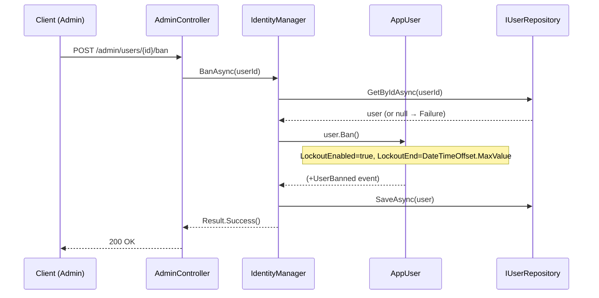
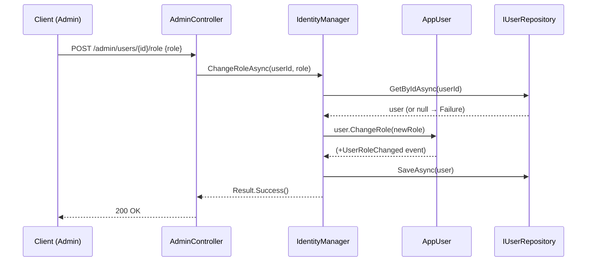

# Use Case: Administration

**Manager:** `IdentityManager`  
**Actor:** Admin user

---

## Ban User

**Entry point:** `POST /admin/users/{id}/ban`

Effect: The user's account is locked indefinitely via ASP.NET Identity lockout. Future login attempts will fail with `"Account is locked out."`.

---

## Change Role

**Entry point:** `POST /admin/users/{id}/role`

## Notes

- The `UserBanned` domain event is published via RabbitMQ and consumed by the Forum service to enforce content restrictions.
- Role changes are reflected in new JWT tokens on next login; existing tokens retain the old role until expiry.
