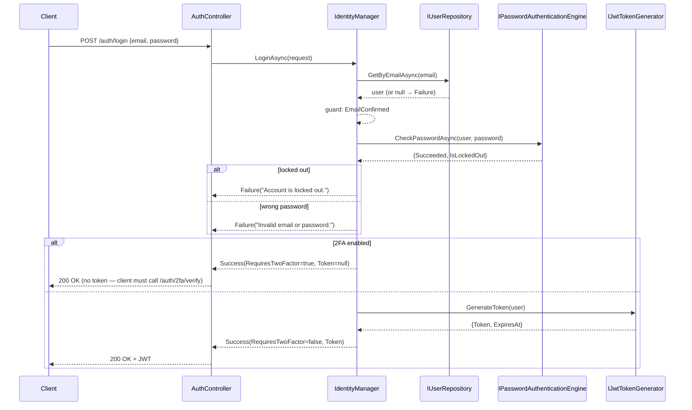
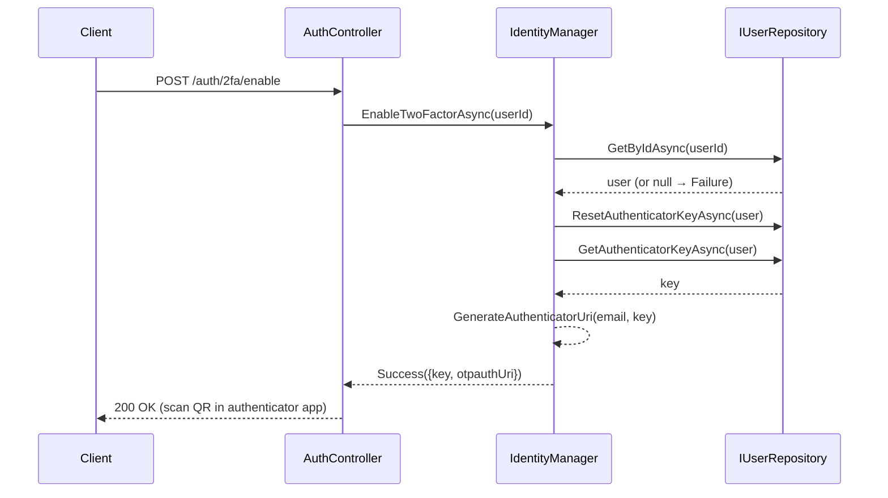
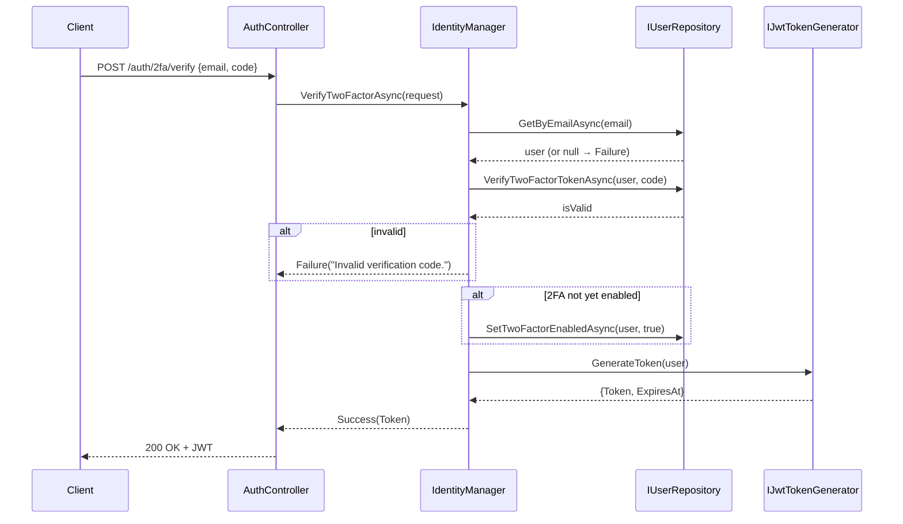

# Use Case: Authentication

**Manager:** `IdentityManager`

---

## Login

**Actor:** Registered user with confirmed email  
**Entry point:** `POST /auth/login`

---

## Enable Two-Factor Authentication

**Entry point:** `POST /auth/2fa/enable`

---

## Verify Two-Factor Code (first-time or login)

**Entry point:** `POST /auth/2fa/verify`

## Guard failures

| Guard | Error |
|---|---|
| User not found | `Failure("User not found.")` or `"Invalid email or password."` |
| Email not confirmed | `Failure("Email not confirmed.")` |
| Account locked out | `Failure("Account is locked out.")` |
| Wrong password | `Failure("Invalid email or password.")` |
| Invalid 2FA code | `Failure("Invalid verification code.")` |
