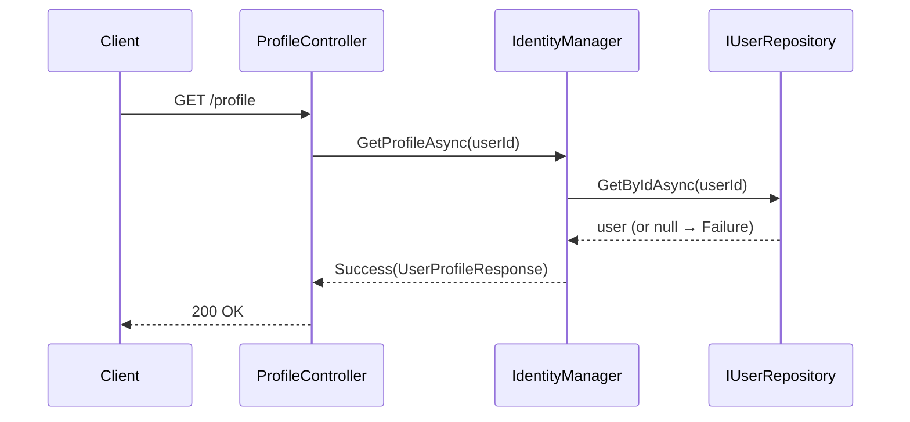
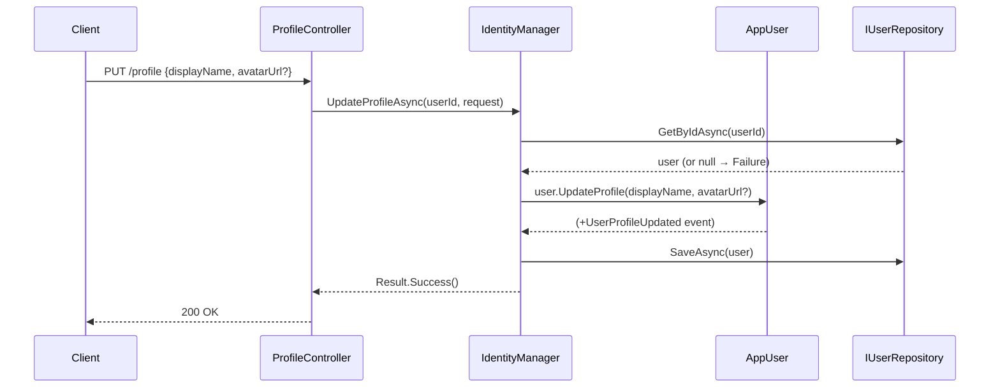
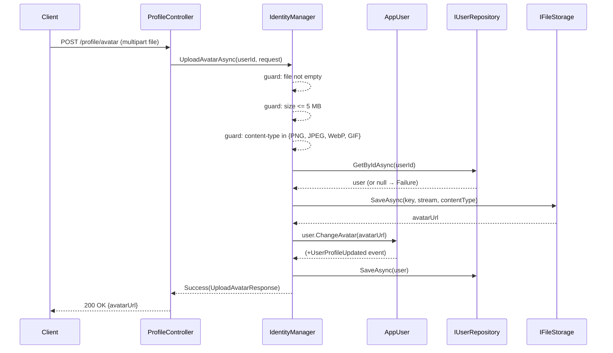

# Use Case: Profile Management

**Manager:** `IdentityManager`

---

## Get Profile

**Actor:** Authenticated user  
**Entry point:** `GET /profile`

---

## Update Profile

**Entry point:** `PUT /profile`

---

## Upload Avatar

**Entry point:** `POST /profile/avatar`

## Guard failures

| Guard | Error |
|---|---|
| File empty | `Failure("File is empty.")` |
| File > 5 MB | `Failure("File exceeds the 5 MB limit.")` |
| Unsupported content type | `Failure("Unsupported image type...")` |
