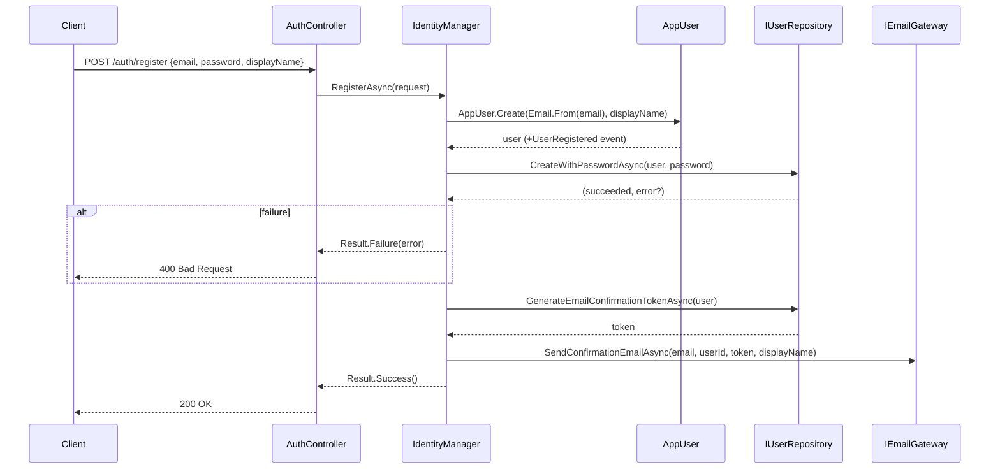
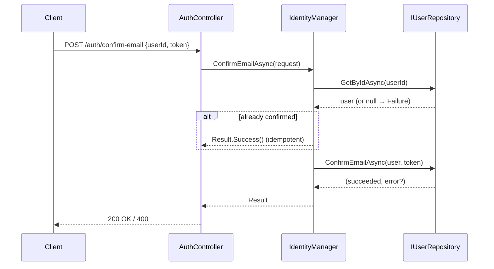

# Use Case: Registration

**Manager:** `IdentityManager`

---

## Register

**Actor:** Anonymous user  
**Entry point:** `POST /auth/register`

---

## Confirm Email

**Entry point:** `POST /auth/confirm-email`

## Guard failures

| Guard | Error |
|---|---|
| Invalid email format | `Email.From` throws `ArgumentException` |
| Duplicate email / weak password | `CreateWithPasswordAsync` returns error string |
| Invalid confirmation token | `ConfirmEmailAsync` returns error |
